## Sections

- [Exploring and visualizing the Housing dataset](#exploring-and-visualizing-the-housing-dataset)
- [Implementing a simple regression model - Ordinary least squares](#implementing-a-simple-regression-model---ordinary-least-squares)
    - [Solving regression parameters with gradient descent](#solving-regression-parameters-with-gradient-descent)
    - [Estimating coefficient of a regression model via scikit-learn](#estimating-coefficient-of-a-regression-model-via-scikit-learn)
- [Fitting a robust regression model using RANSAC](#fitting-a-robust-regression-model-using-ransac)
- [Evaluating the performance of linear regression models](#evaluating-the-performance-of-linear-regression-models)
- [Turning a linear regression model into a curve - Polynomial regression](#turning-a-linear-regression-model-into-a-curve---polynomial-regression)
- [Modeling nonlinear relationships in the Housing dataset](#modeling-nonlinear-relationships-in-the-housing-dataset)

<br>
<br>

# Exploring and visualizing the Housing dataset

[[back to top](#sections)]


波士顿房价数据

Source: [https://archive.ics.uci.edu/ml/datasets/Housing](https://archive.ics.uci.edu/ml/datasets/Housing)

Attributes:

```
1. CRIM      per capita crime rate by town 每个城镇人均犯罪率
2. ZN        proportion of residential land zoned for lots over
                 25,000 sq.ft. 超过25000平方尺用地划为居住用地的百分比
3. INDUS     proportion of non-retail business acres per town 非零售商用地百分比
4. CHAS      Charles River dummy variable (= 1 if tract bounds
                 river; 0 otherwise) 是否被河道包围
5. NOX       nitric oxides concentration (parts per 10 million) 氮氧化物浓度
6. RM        average number of rooms per dwelling 住宅平均房间数目
7. AGE       proportion of owner-occupied units built prior to 1940 1940年前建成自用单位比例
8. DIS       weighted distances to five Boston employment centres 5个波士顿就业服务中心的加权距离
9. RAD       index of accessibility to radial highways 无障碍径向高速公路指数
10. TAX      full-value property-tax rate per $10,000 每万元物业税率
11. PTRATIO  pupil-teacher ratio by town 小学师生比例
12. B        1000(Bk - 0.63)^2 where Bk is the proportion of blacks
                 by town 黑人比例指数
13. LSTAT    % lower status of the population 低层人口比例
14. MEDV     Median value of owner-occupied homes in $1000's 业主自住房屋中值 （要预测的变量）
```


```python
# 读取数据
import pandas as pd
df = pd.read_csv('https://archive.ics.uci.edu/ml/machine-learning-databases/housing/housing.data',
                 header=None, sep='\s+')  # 分隔符为空格

df.columns = ['CRIM', 'ZN', 'INDUS', 'CHAS',
              'NOX', 'RM', 'AGE', 'DIS', 'RAD',
              'TAX', 'PTRATIO', 'B', 'LSTAT', 'MEDV']
df.head()
```


<div>
<table border="1" class="dataframe">
  <thead>
    <tr style="text-align: right;">
      <th></th>
      <th>CRIM</th>
      <th>ZN</th>
      <th>INDUS</th>
      <th>CHAS</th>
      <th>NOX</th>
      <th>RM</th>
      <th>AGE</th>
      <th>DIS</th>
      <th>RAD</th>
      <th>TAX</th>
      <th>PTRATIO</th>
      <th>B</th>
      <th>LSTAT</th>
      <th>MEDV</th>
    </tr>
  </thead>
  <tbody>
    <tr>
      <th>0</th>
      <td>0.00632</td>
      <td>18.0</td>
      <td>2.31</td>
      <td>0</td>
      <td>0.538</td>
      <td>6.575</td>
      <td>65.2</td>
      <td>4.0900</td>
      <td>1</td>
      <td>296.0</td>
      <td>15.3</td>
      <td>396.90</td>
      <td>4.98</td>
      <td>24.0</td>
    </tr>
    <tr>
      <th>1</th>
      <td>0.02731</td>
      <td>0.0</td>
      <td>7.07</td>
      <td>0</td>
      <td>0.469</td>
      <td>6.421</td>
      <td>78.9</td>
      <td>4.9671</td>
      <td>2</td>
      <td>242.0</td>
      <td>17.8</td>
      <td>396.90</td>
      <td>9.14</td>
      <td>21.6</td>
    </tr>
    <tr>
      <th>2</th>
      <td>0.02729</td>
      <td>0.0</td>
      <td>7.07</td>
      <td>0</td>
      <td>0.469</td>
      <td>7.185</td>
      <td>61.1</td>
      <td>4.9671</td>
      <td>2</td>
      <td>242.0</td>
      <td>17.8</td>
      <td>392.83</td>
      <td>4.03</td>
      <td>34.7</td>
    </tr>
    <tr>
      <th>3</th>
      <td>0.03237</td>
      <td>0.0</td>
      <td>2.18</td>
      <td>0</td>
      <td>0.458</td>
      <td>6.998</td>
      <td>45.8</td>
      <td>6.0622</td>
      <td>3</td>
      <td>222.0</td>
      <td>18.7</td>
      <td>394.63</td>
      <td>2.94</td>
      <td>33.4</td>
    </tr>
    <tr>
      <th>4</th>
      <td>0.06905</td>
      <td>0.0</td>
      <td>2.18</td>
      <td>0</td>
      <td>0.458</td>
      <td>7.147</td>
      <td>54.2</td>
      <td>6.0622</td>
      <td>3</td>
      <td>222.0</td>
      <td>18.7</td>
      <td>396.90</td>
      <td>5.33</td>
      <td>36.2</td>
    </tr>
  </tbody>
</table>
</div>


数据分析的第一步是进行**探索性数据分析 (Exploratory Data Analysis, EDA)**，理解变量的分布与变量之间的关系。


```python
%matplotlib inline

import matplotlib.pyplot as plt
import seaborn as sns
sns.set(style='whitegrid', context='notebook')  # 设定样式，还原可用 sns.reset_orig

# MEDV 是目标变量，为了方便演示，只挑 4 个预测变量
cols = ['LSTAT', 'INDUS', 'NOX', 'RM', 'MEDV']

# scatterplot matrix, 对角线上是变量分布的直方图，非对角线上是两个变量的散点图
sns.pairplot(df[cols], size=2.5)
plt.tight_layout()

# 用下面这行代码可以存储图片到硬盘中
# plt.savefig('./figures/scatter.png', dpi=300)
```


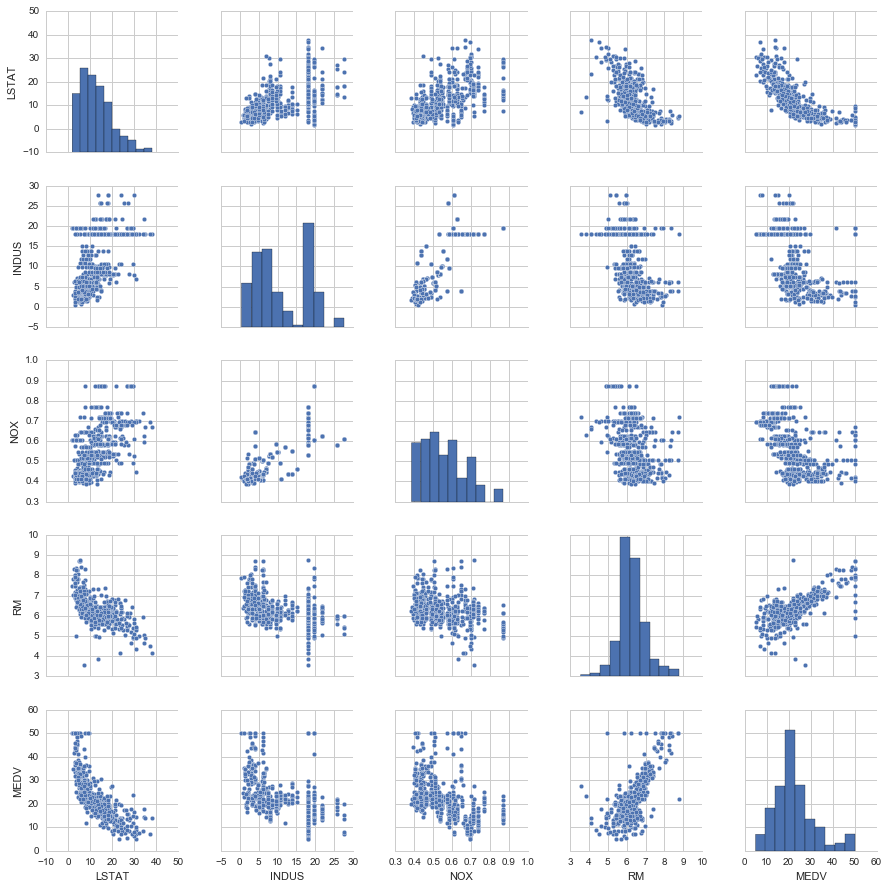


从图中看出
+ RM 和 MEDV 似乎是有线性关系的
+ MEDV 类似 normal distribution


```python
# correlation map
import numpy as np
cm = np.corrcoef(df[cols].values.T)  # 计算相关系数
sns.set(font_scale=1.5)

# 画相关系数矩阵的热点图
hm = sns.heatmap(cm,
        annot=True,
        square=True,
        fmt='.2f',
        annot_kws={'size': 15},
        yticklabels=cols,
        xticklabels=cols)
plt.tight_layout()
# plt.savefig('./figures/corr_mat.png', dpi=300)
```


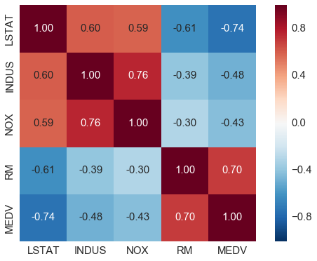


+ 对与 MEDV correlation 高的变量感兴趣,  LSTAT 最高(-0.74), 其次是 RM (0.7)
+ 但从之前的图看出 MEDV 与 LSTAT 呈非线性关系，而与 RM 更呈线性关系，所以下面选用 RM 来演示简单线性回归


```python
sns.reset_orig()
```

<br>
<br>

# Implementing a simple regression model - Ordinary least squares

## Solving regression parameters with gradient descent

## 梯度下降法
梯度下降法是一个最优化算法，通常也称为最速下降法。最速下降法是求解无约束优化问题最简单和最古老的方法之一，虽然现在已经不具有实用性，但是许多有效算法都是以它为基础进行改进和修正而得到的。最速下降法是用负梯度方向为搜索方向的，最速下降法越接近目标值，步长越小，前进越慢。

Wiki上的解释为如果目标函数$$F(x)$$在点$$a$$处可微且有定义，那么函数$$F(x)$$在点$$a$$沿着梯度相反的方向$$-\nabla F(a)$$下降最快。其中,$$\nabla$$为梯度算子，$$\nabla = (\frac{\partial}{\partial x_1}, \frac{\partial}{\partial x_2}, \ldots, \frac{\partial}{\partial x_n})^T$$

#### 什么是梯度下降法？
- 梯度下降法，可作为一种求解最小二乘法的方式，它是最优化中比较古老的一种方法
- 梯度下降，设定起始点负梯度方向 (即数值减小的方向) 为搜索方向，寻找最小值。梯度下降法越接近目标值，步长越小，前进越慢.


<br>

损失函数 $$ J(w) = \frac{1}{2} \sum^n_{i=1} (y^{(i)} - \hat y^{(i)})^2$$
梯度 $$ \frac {\partial J}{\partial w_j}=-\sum^n_{i=1} (y^{(i)}-\hat y^{(i)})x_j^{(i)}$$
更新规则 $$w:=w-\eta\frac{\partial J}{\partial w}$$
<br>


```python
class LinearRegressionGD(object):

    def __init__(self, eta=0.001, n_iter=20):
        self.eta = eta  # learning rate 学习速率
        self.n_iter = n_iter  # 迭代次数

    def fit(self, X, y):  # 训练函数
        # self.w_ = np.zeros(1, 1 + X.shape[1])
        self.coef_ = np.zeros(shape=(1, X.shape[1]))  # 代表被训练的系数，初始化为 0
        self.intercept_ = np.zeros(1)
        self.cost_ = []   # 用于保存损失的空list

        for i in range(self.n_iter):
            output = self.net_input(X)  # 计算预测的Y
            errors = y - output
            self.coef_ += self.eta * np.dot(errors.T, X)  # 根据更新规则更新系数，思考一下为什么不是减号？
            self.intercept_ += self.eta * errors.sum()  # 更新 bias，相当于x取常数1
            cost = (errors**2).sum() / 2.0     # 计算损失
            self.cost_.append(cost)  # 记录损失函数的值
        return self

    def net_input(self, X):   # 给定系数和X计算预测的Y
        return np.dot(X, self.coef_.T) + self.intercept_

    def predict(self, X):
        return self.net_input(X)
```


```python
# RM 作为 explanatory variable
X = df[['RM']].values
y = df[['MEDV']].values
```


```python
# standardize
from sklearn.preprocessing import StandardScaler
sc_x = StandardScaler()
sc_y = StandardScaler()
X_std = sc_x.fit_transform(X)
y_std = sc_y.fit_transform(y)
```


```python
lr = LinearRegressionGD()
lr.fit(X_std, y_std);  # 喂入数据进行训练
```


```python
# cost function
plt.plot(range(1, lr.n_iter+1), lr.cost_)
plt.ylabel('SSE')
plt.xlabel('Epoch')
plt.tight_layout()
```


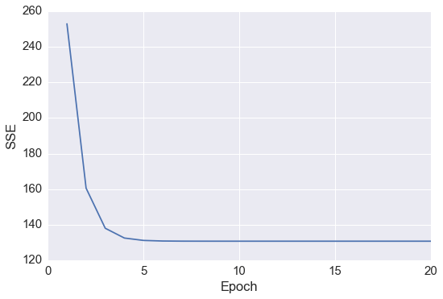


发现在 epoch 5之后 cost 基本就不能再减小了


```python
# 定义一个绘图函数用于展示
def lin_regplot(X, y, model):
    plt.scatter(X, y, c='lightblue')
    plt.plot(X, model.predict(X), color='red', linewidth=2)
    return None
```


```python
# 画出预测
lin_regplot(X_std, y_std, lr)
plt.xlabel('Average number of rooms [RM] (standardized)')
plt.ylabel('Price in $1000\'s [MEDV] (standardized)')
plt.tight_layout()
plt.show()
```


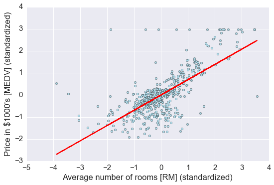


```python
print('Slope: %.3f' % lr.coef_[0])
print('Intercept: %.3f' % lr.intercept_)
# 直线的斜率及截距
```

    Slope: 0.695
    Intercept: -0.000


```python
# 预测 RM=5 时，房价为多少
num_rooms_std = sc_x.transform([[5.0]])
price_std = lr.predict(num_rooms_std)
print("Price in $1000's: %.3f" % sc_y.inverse_transform(price_std))
```

    Price in $1000's: 10.840


<br>
<br>

## Estimating coefficient of a regression model via scikit-learn

[[back to top](#sections)]


```python
from sklearn.linear_model import LinearRegression
```


```python
slr = LinearRegression()
slr.fit(X_std, y_std)
print('Slope: %.3f' % slr.coef_[0])
print('Intercept: %.3f' % slr.intercept_)
```

    Slope: 0.695
    Intercept: -0.000


```python
lin_regplot(X_std, y_std, slr)
plt.xlabel('Average number of rooms [RM] (standardized)')
plt.ylabel('Price in $1000\'s [MEDV] (standardized)')
plt.tight_layout()
```


```python
# 如果不标准化，直接用原始数据进行回归
slr.fit(X, y)
lin_regplot(X, y, slr)
plt.xlabel('Average number of rooms [RM]')
plt.ylabel('Price in $1000\'s [MEDV]')
plt.tight_layout()
```


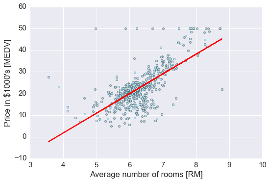


结果与使用 gradient descent 的结果接近，思考一下什么时候需要使用标准化？

<br>
<br>

# Fitting a robust regression model using RANSAC

[[back to top](#sections)]

线性回归对 outlier 比较敏感, 而对是否删除 outlier 是需要自己进行判断的. 另一种方法就是 [RANdom SAmple Consensus (RANSAC)](http://scikit-learn.org/stable/modules/linear_model.html#ransac-random-sample-consensus)

大致算法如下:
1. Select a random number of samples to be inliers and fit the model.
2. Test all other data points against the fitted model and add those points that fall within a user-given tolerance to the inliers.
3. Refit the model using all inliers.
4. Estimate the error of the fitted model versus the inliers.
5. Terminate the algorithm if the performance meets a certain user-defined threshold or if a fixed number of iterations has been reached; go back to step 1 otherwise.


```python
# 使用 sklearn 中已有函数
from sklearn.linear_model import RANSACRegressor
ransac = RANSACRegressor(LinearRegression(),
                         max_trials=100, # max iteration
                         min_samples=50, # min number of randomly chosen samples
                         residual_metric=lambda dy: np.sum(np.abs(dy), axis=1), # absolute vertical distances to measure
                         residual_threshold=5.0, # allow sample as inlier within 5 distance units
                         random_state=0)
ransac.fit(X, y)

# 分出 inlier 和 outlier
inlier_mask = ransac.inlier_mask_
outlier_mask = np.logical_not(inlier_mask)

line_X = np.arange(3, 10, 1)
line_y_ransac = ransac.predict(line_X[:, np.newaxis])
plt.scatter(X[inlier_mask], y[inlier_mask], c='blue', marker='o', label='Inliers')
plt.scatter(X[outlier_mask], y[outlier_mask], c='lightgreen', marker='s', label='Outliers')
plt.plot(line_X, line_y_ransac, color='red')
plt.xlabel('Average number of rooms [RM]')
plt.ylabel('Price in $1000\'s [MEDV]')
plt.legend(loc='upper left')

plt.tight_layout()
```


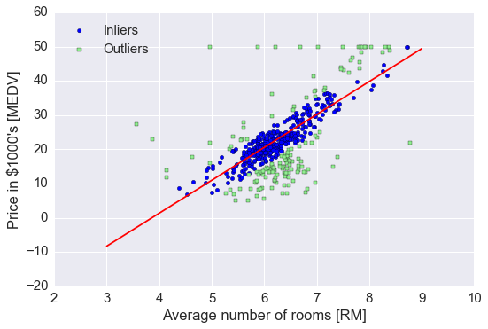


```python
print('Slope: %.3f' % ransac.estimator_.coef_[0])
print('Intercept: %.3f' % ransac.estimator_.intercept_)
```

    Slope: 9.621
    Intercept: -37.137


RANSAC 减少了 outlier 的影响, 但对于未知数据的预测能力是否有影响未知.

对比 RANSAC 回归和 OLS 回归


```python
from sklearn import datasets

n_samples = 1000
n_outliers = 50


X, y, coef = datasets.make_regression(n_samples=n_samples, n_features=1,
                                      n_informative=1, noise=10,
                                      coef=True, random_state=0)

# Add outlier data
np.random.seed(0)
X[:n_outliers] = 3 + 0.5 * np.random.normal(size=(n_outliers, 1))
y[:n_outliers] = -3 + 10 * np.random.normal(size=n_outliers)

# Fit line using all data
model = LinearRegression()
model.fit(X, y)

# Robustly fit linear model with RANSAC algorithm
model_ransac = RANSACRegressor(LinearRegression())
model_ransac.fit(X, y)
inlier_mask = model_ransac.inlier_mask_
outlier_mask = np.logical_not(inlier_mask)

# Predict data of estimated models
line_X = np.arange(-5, 5)
line_y = model.predict(line_X[:, np.newaxis])
line_y_ransac = model_ransac.predict(line_X[:, np.newaxis])

# Compare estimated coefficients
print("Estimated coefficients (true, normal, RANSAC):")
print(coef, model.coef_, model_ransac.estimator_.coef_)

plt.plot(X[inlier_mask], y[inlier_mask], '.g', label='Inliers')
plt.plot(X[outlier_mask], y[outlier_mask], '.r', label='Outliers')
plt.plot(line_X, line_y, '-k', label='Linear regressor')
plt.plot(line_X, line_y_ransac, '-b', label='RANSAC regressor')
plt.legend(loc='lower right');
```

    Estimated coefficients (true, normal, RANSAC):
    (array(82.1903908407869), array([ 54.17236387]), array([ 82.08533159]))


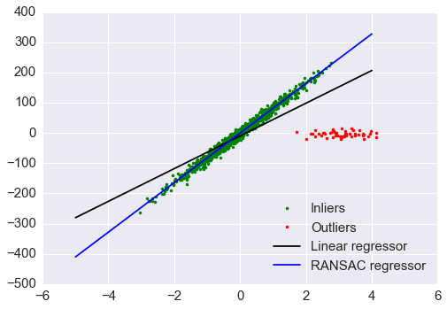


<br>
<br>

# Evaluating the performance of linear regression models

It is crucial to test the model on data that it hasn't seen during training to obtain an unbiased estimate of its performance.

[[back to top](#sections)]


```python
from sklearn.cross_validation import train_test_split

X = df.iloc[:, :-1].values
y = df['MEDV'].values

X_train, X_test, y_train, y_test = train_test_split(
    X, y, test_size=0.3, random_state=0)
# 70% 用于 train, 30%用于 test
```


```python
slr = LinearRegression()

slr.fit(X_train, y_train)
y_train_pred = slr.predict(X_train)
y_test_pred = slr.predict(X_test)
```


```python
# residual plot, 经常被用来检查回归模型
plt.scatter(y_train_pred,  y_train_pred - y_train, c='blue', marker='o', label='Training data')
plt.scatter(y_test_pred,  y_test_pred - y_test, c='lightgreen', marker='s', label='Test data')
plt.xlabel('Predicted values')
plt.ylabel('Residuals')
plt.legend(loc='upper left')
plt.hlines(y=0, xmin=-10, xmax=50, lw=2, color='red')
plt.xlim([-10, 50])
plt.tight_layout()
# plt.savefig('./figures/slr_residuals.png', dpi=300)
```


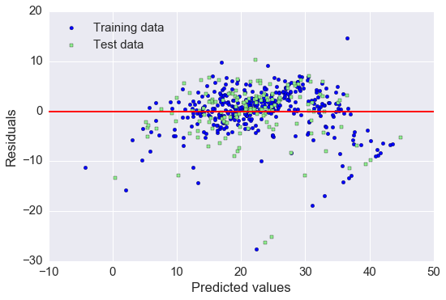


如果预测都是正确的, 那么 residual 就是0. 这是理想情况, 实际中, 我们希望 error 是随机分布的.

从上图看, 有部分 error 是离红色线较远的, 可能是 outlier 引起较大的偏差


```python
# 另一种评估方法是 Mean Squred Error, MSE, 就是 SSE 的平均值
# R-squre 也是重要的 measurement, 它代表着有多少百分比的数据被模型解释. 越高代表模型拟合越好
from sklearn.metrics import r2_score
from sklearn.metrics import mean_squared_error
print('MSE train: %.3f, test: %.3f' % (
        mean_squared_error(y_train, y_train_pred),
        mean_squared_error(y_test, y_test_pred)))
print('R^2 train: %.3f, test: %.3f' % (
        r2_score(y_train, y_train_pred),
        r2_score(y_test, y_test_pred)))
```

    MSE train: 19.958, test: 27.196
    R^2 train: 0.765, test: 0.673


$$ MSE = \frac 1 n \sum^n_{i=1} (y^{(i)} - \hat y^{(i)})$$
$$ R^2 = 1 - \frac{SSE}{SST} = 1 - \frac{MSE}{Var(y)}$$

<br>
<br>

# Turning a linear regression model into a curve - Polynomial regression

[[back to top](#sections)]


```python
import numpy as np
from
```


```python
X = np.array([258.0, 270.0, 294.0,
              320.0, 342.0, 368.0,
              396.0, 446.0, 480.0, 586.0])[:, np.newaxis]

y = np.array([236.4, 234.4, 252.8,
              298.6, 314.2, 342.2,
              360.8, 368.0, 391.2,
              390.8])
```


```python
# 添加二次项和截距项

from sklearn.preprocessing import PolynomialFeatures

lr = LinearRegression()
pr = LinearRegression()
quadratic = PolynomialFeatures(degree=2)
X_quad = quadratic.fit_transform(X)
```


```python
print(X.shape)
print(X_quad.shape)
```

    (10, 1)
    (10, 3)


```python
X_quad
```


    array([[  1.00000000e+00,   2.58000000e+02,   6.65640000e+04],
           [  1.00000000e+00,   2.70000000e+02,   7.29000000e+04],
           [  1.00000000e+00,   2.94000000e+02,   8.64360000e+04],
           [  1.00000000e+00,   3.20000000e+02,   1.02400000e+05],
           [  1.00000000e+00,   3.42000000e+02,   1.16964000e+05],
           [  1.00000000e+00,   3.68000000e+02,   1.35424000e+05],
           [  1.00000000e+00,   3.96000000e+02,   1.56816000e+05],
           [  1.00000000e+00,   4.46000000e+02,   1.98916000e+05],
           [  1.00000000e+00,   4.80000000e+02,   2.30400000e+05],
           [  1.00000000e+00,   5.86000000e+02,   3.43396000e+05]])


```python
# fit linear features
lr.fit(X, y)
X_fit = np.arange(250,600,10)[:, np.newaxis]
y_lin_fit = lr.predict(X_fit)

# fit quadratic features
pr.fit(X_quad, y)
y_quad_fit = pr.predict(quadratic.fit_transform(X_fit))

# plot results
plt.scatter(X, y, label='training points')
plt.plot(X_fit, y_lin_fit, label='linear fit', linestyle='--')
plt.plot(X_fit, y_quad_fit, label='quadratic fit')
plt.legend(loc='upper left')

plt.tight_layout()
```


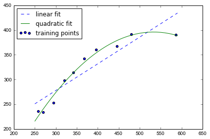


图上可以发现 quadratic fit比 linear 拟合效果更好


```python
y_lin_pred = lr.predict(X)
y_quad_pred = pr.predict(X_quad)
```


```python
print('Training MSE linear: %.3f, quadratic: %.3f' % (
        mean_squared_error(y, y_lin_pred),
        mean_squared_error(y, y_quad_pred)))
print('Training  R^2 linear: %.3f, quadratic: %.3f' % (
        r2_score(y, y_lin_pred),
        r2_score(y, y_quad_pred)))
```

    Training MSE linear: 569.780, quadratic: 61.330
    Training  R^2 linear: 0.832, quadratic: 0.982


MSE 下降到61, R^2 上升到98%, 说明在这个数据集上 quadratic fit 效果更好

<br>
<br>

## Modeling nonlinear relationships in the Housing dataset

我们会将house prices 与 LSTAT 的 quadratic 及 cubic polynomials fit, 并与 linear fit 对比

[back to top](#sections)


```python
X = df[['LSTAT']].values
y = df['MEDV'].values

regr = LinearRegression()

# create quadratic features
quadratic = PolynomialFeatures(degree=2)
cubic = PolynomialFeatures(degree=3)
X_quad = quadratic.fit_transform(X)
X_cubic = cubic.fit_transform(X)

# fit features
X_fit = np.arange(X.min(), X.max(), 1)[:, np.newaxis]

regr = regr.fit(X, y)
y_lin_fit = regr.predict(X_fit)
linear_r2 = r2_score(y, regr.predict(X))

regr = regr.fit(X_quad, y)
y_quad_fit = regr.predict(quadratic.fit_transform(X_fit))
quadratic_r2 = r2_score(y, regr.predict(X_quad))

regr = regr.fit(X_cubic, y)
y_cubic_fit = regr.predict(cubic.fit_transform(X_fit))
cubic_r2 = r2_score(y, regr.predict(X_cubic))


# plot results
plt.scatter(X, y, label='training points', color='lightgray')

plt.plot(X_fit, y_lin_fit,
         label='linear (d=1), $R^2=%.2f$' % linear_r2,
         color='blue',
         lw=2,
         linestyle=':')

plt.plot(X_fit, y_quad_fit,
         label='quadratic (d=2), $R^2=%.2f$' % quadratic_r2,
         color='red',
         lw=2,
         linestyle='-')

plt.plot(X_fit, y_cubic_fit,
         label='cubic (d=3), $R^2=%.2f$' % cubic_r2,
         color='green',
         lw=2,
         linestyle='--')

plt.xlabel('% lower status of the population [LSTAT]')
plt.ylabel('Price in $1000\'s [MEDV]')
plt.legend(loc='upper right')

plt.tight_layout()
# plt.savefig('./figures/polyhouse_example.png', dpi=300)
```


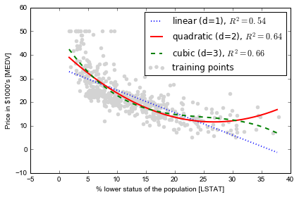


Transforming the dataset by log: 为什么要这样做？是因为有画图探索的启示？


```python
X = df[['LSTAT']].values
y = df['MEDV'].values

# transform features
X_log = np.log(X)
y_sqrt = np.sqrt(y)

# fit features
X_fit = np.arange(X_log.min()-1, X_log.max()+1, 1)[:, np.newaxis]

regr = regr.fit(X_log, y_sqrt)
y_lin_fit = regr.predict(X_fit)
linear_r2 = r2_score(y_sqrt, regr.predict(X_log))

# plot results
plt.scatter(X_log, y_sqrt, label='training points', color='lightgray')

plt.plot(X_fit, y_lin_fit,
         label='linear (d=1), $R^2=%.2f$' % linear_r2,
         color='blue',
         lw=2)

plt.xlabel('log(% lower status of the population [LSTAT])')
plt.ylabel('$\sqrt{Price \; in \; \$1000\'s [MEDV]}$')
plt.legend(loc='lower left')

plt.tight_layout()
# plt.savefig('./figures/transform_example.png', dpi=300)
plt.show()
```


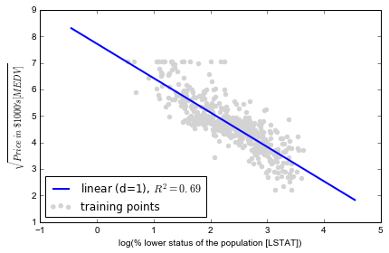


经过 log 变换后，线性拟合效果已经不错, 比单纯 polynomial fit 更好

## 练习：用房价数据的其它自变量一起做一个多元模型看看R2有没有改善


```python

```
